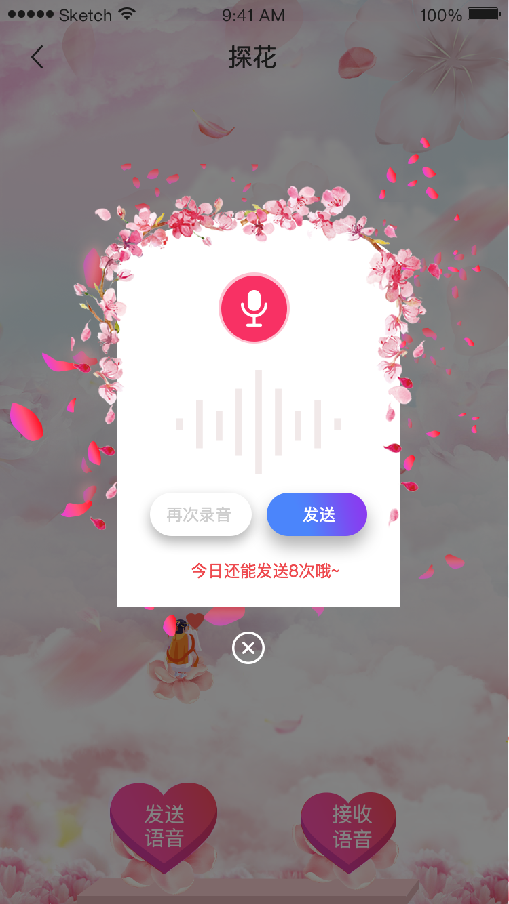
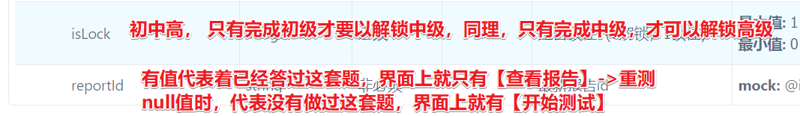
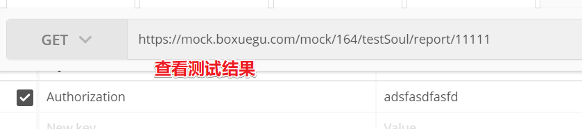
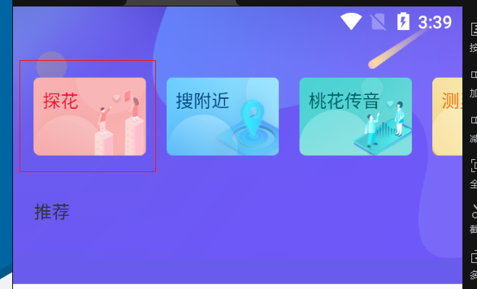

## 1、项目实战

在项目实战中，需要基于提供的代码基础之上进行新功能的开发，此次项目实战需要完成的新功能有两个，分别是：桃花传音和测灵魂，功能的选择根据分组情况进行，功能的实现需要从需求分析开始到表结构的设计，再到实现，包含了整个开发环节。

【分组开发】

学生独立完成

有问题组内解决。组内解决不了，组外解决。找老师（需求 不扣分， 项目bug 扣1/3分, 最多扣9分..）

由组长提交代码到gitee上（共享用户名与密码） 推荐使用分支

组员从gitee克隆代码

推送代码时由组长来推送到gitee上

每天要汇报项目进度(ones)

最后一天下午14：30分，项目演示，远程演示

## 2、桃花传音

主要功能点：

- 语音匹配类似漂流瓶类似，可以发送匿名语音，可以收听匿名语音，收听完匿名语音可以选择喜欢或不喜欢。
- 如果双方互相喜欢那么可以配对成功互相喜欢,则成为好友
- 语音文件要存到oss上，录音时录多一些且要有声音

### 2.1、效果

#### 2.1.1、首页

在桃花传音的首页中，可以选择接收或者发送语音。

 

#### 2.1.2、接收语音

点击接收语音按钮，随机查询一个语音消息返回，在听完语音后，可以选择喜欢或者不喜欢，如果双方互相喜欢那么可以配对成功互相关注。

 

#### 2.1.3、发送语音

用户可以选择发送语音，录制一段语音后发出。

 

## 3、测灵魂

基本需求：

- 测试题用于对用户进行分类，每次提交答案后更新用户属性
- 测试题为顺序回答，回答完初级题解锁下一级问题
- 点击锁定问题 显示提示 请先回答上一级问题

 

 

查看结果:

 

## 4、探花【选做】有做的话+分

 

 

### API

查询推荐佳人列表

 

 探花喜欢： 添加user_like 登陆用户喜欢这个人，右滑

探花不喜欢：添加黑名单 tb_black_list

 